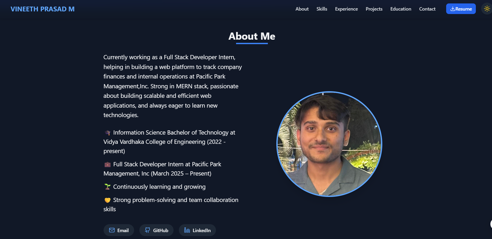

# Vineeth Prasad M — Portfolio Website

Welcome to my professional portfolio! This website showcases my journey, skills, projects, certifications, and experience as a Full Stack Developer passionate about building impactful web applications.

## 🚀 Live Demo

[View My Portfolio](https://portfolio-website-omega-five-51.vercel.app/)  


---

## 👨‍💻 About This Project
This portfolio is designed to present my technical expertise, personal growth, and achievements in a clean, modern, and mobile-friendly way. It features:
- A professional timeline of my learning and career
- Skills and technology stack
- Project highlights with live demos and source code
- Education and certifications
- A contact form for direct communication

---

## ✨ Features
- **Responsive Design:** Looks great on all devices
- **Light/Dark Mode:** Toggle for user preference
- **Professional Timeline:** Visualizes my journey and milestones
- **Project Showcase:** Details, live demos, and GitHub links
- **Contact Form:** EmailJS-powered, messages go directly to my inbox
- **Downloadable Resume:** Easy access for recruiters

---

## 🛠️ Tech Stack
- [React](https://react.dev/)
- [TypeScript](https://www.typescriptlang.org/)
- [Vite](https://vitejs.dev/)
- [Tailwind CSS](https://tailwindcss.com/)
- [EmailJS](https://www.emailjs.com/) (contact form)
- [Vercel](https://vercel.com/) (deployment)

---

## 📸 Screenshots

  


---

## 🏁 Getting Started

To run this project locally:

```bash
git clone https://github.com/VineethM2004/Portfolio-Website.git
cd Portfolio-Website
npm install
npm run dev
```

---

## 📂 Project Structure
- `src/` — Main source code (components, data, styles)
- `public/` — Static assets (images, resume, etc.)
- `README.md` — This file

---

## 🏆 Certifications & Achievements
- IBM SkillsBuild Mastering Data with Machine Learning Internship with CSRBOX
- Introduction to MongoDB (For Students) — MongoDB University
- Developing Back-End Apps with Node.js and Express — IBM (via Coursera)
- Introduction to HTML, CSS, & JavaScript — IBM (via Coursera)

---

## 📬 Contact
If you'd like to connect, collaborate, or have any questions, feel free to reach out!

- Email: vineethprasad9@gmail.com
- [LinkedIn](https://www.linkedin.com/in/vineeth-prasad-m-40a4992a3/)
- [GitHub](https://github.com/VineethM2004)

---

## 📝 License

This project is open source and available under the [MIT License](LICENSE).